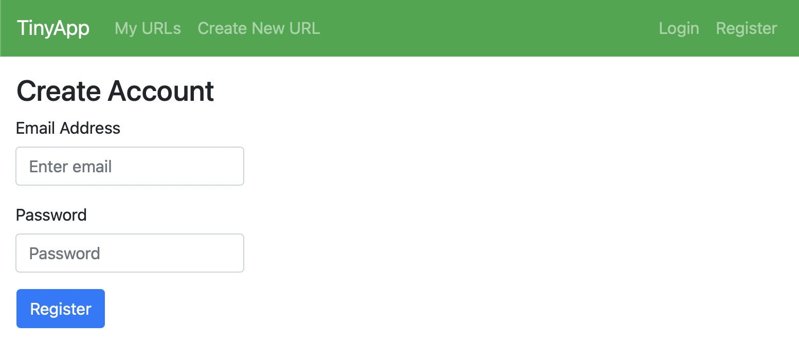
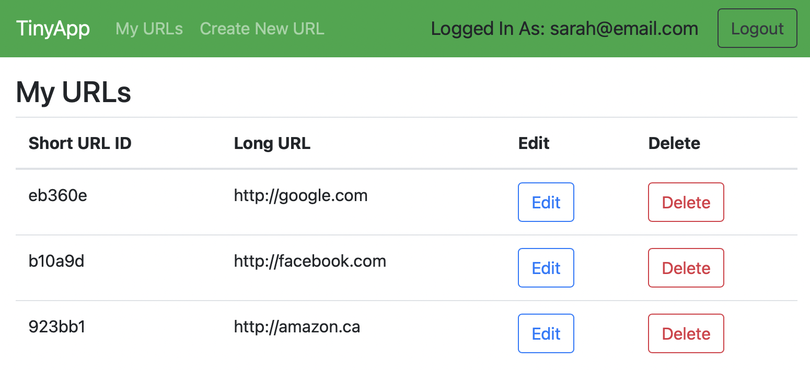
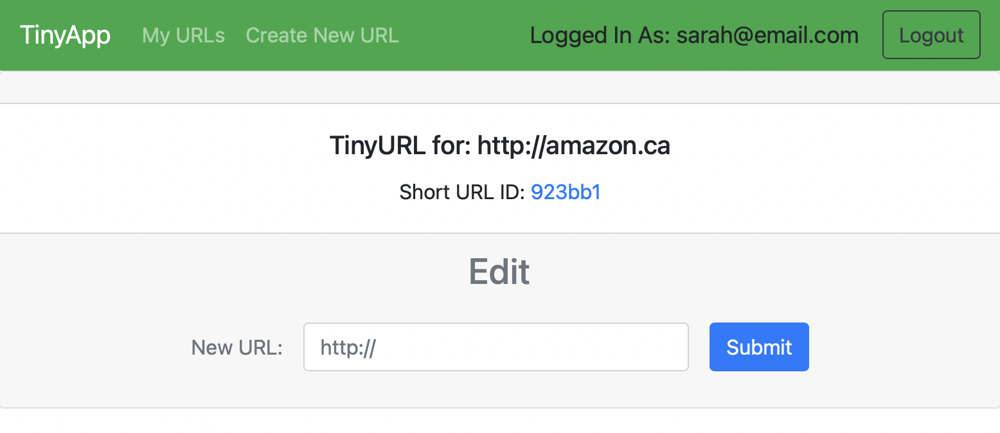

# TinyApp

TinyApp is a web server that shortens URL's.

### Description

Users can start by creating an account, once logged in they can view, create, update or delete their url's. Once a url has been created, it gets added to the database, the user can now visit the link via the shortened url. Once finised with their session they can logout.

**_BEWARE:_ This library was published for learning purposes. It is _not_ intended for use in production-grade software.**

This project was created and published by me as part of my learnings at Lighthouse Labs.

### Installation

* Fork and clone this repository
  * IP address: localhost (127.0.0.1)
  * PORT: 8080
  * initialize web server from command-line with:
  - npm start
  - localhost:8080/ to connect to server from browser

### Final Product

### Built With

[![Bootstrap][Bootstrap.com]][Bootstrap-url]
[![Node][Node.js]][Node-url]
[![Express][Express.ejs]][Bootstrap-url]